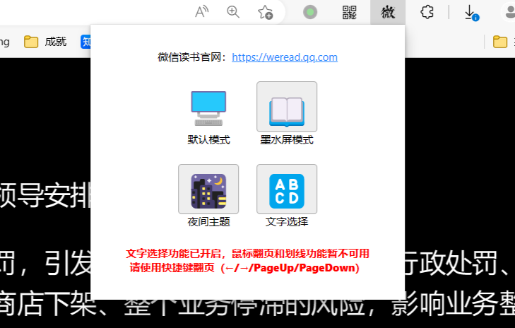
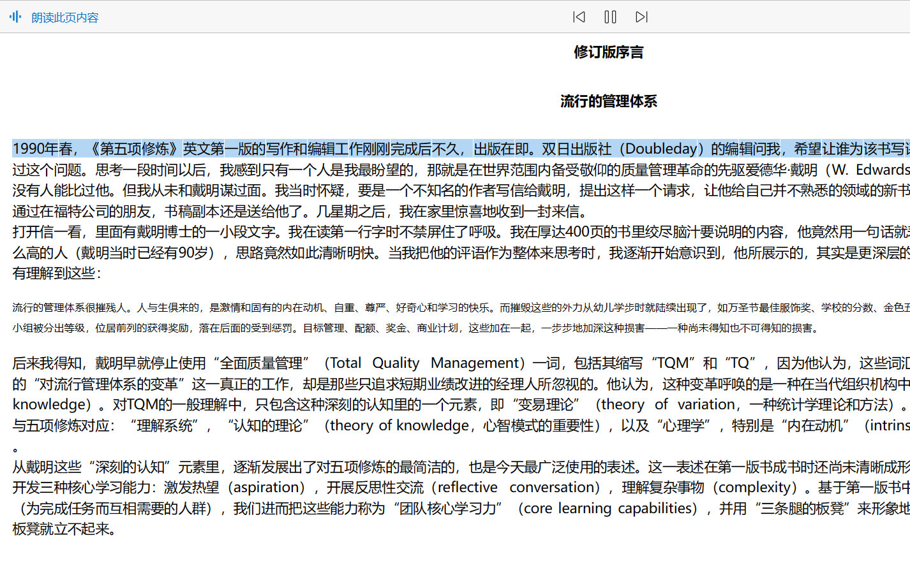

# 微信读书朗读助手
*注：本插件不提供语音朗读功能，请配合浏览器自带朗读功能使用。*

## 简介
这是一个基于chrome内核的浏览器插件。

可以让微信读书切换为墨水屏模式，书籍内容可以被浏览器的“大声朗读”功能所识别。

## 功能
1. 支持按键翻页（←/→/PageUp/PageDown）
2. 支持文字选择（需要手动启用）
3. 支持夜间模式（需要手动启用）

## 截图

### 主界面
 
### 书架
 
### 正文
 
